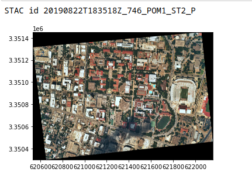

# Getting Started with NearSpace Labs API and Anaconda

The [`nsl.stac`](https://pypi.org/project/nsl.stac/) Python package lets you find aerial imagery by area of interest, data, and other attributes. It also downloads Near Space Labs Geotiffs and thumbnails. The client connects to Near Space Labs [STAC](https://stacspec.org/) service for imagery metadata queries and imagery server to retrieve imagery.

## What you need for this tutorial

Request access to the NearSpace Labs [API](https://nearspacelabs.com/#nearspacelabs). You need these credentials to access services.

For this tutorial, install [Anaconda](https://www.anaconda.com/products/individual) which is a Python distribution that includes [JupyterLabs](https://jupyter.org/install). JupyterLabs provides a web-based interactive environment for data science and machine learning.

We will also use [`nsl.stac`](https://pypi.org/project/nsl.stac/) to connect to NearSpace Labs STAC server and retrieve imagery.

### Best practice

For each Python project, it's best practice to create a virtual environment that contains the packages required by the project. Anaconda includes a package manager called  [`conda`](https://docs.conda.io/en/latest/). Run the following to create a new virtual `conda` environment and activate it.

```bash
$ conda create --name venv python=3.8
$ conda activate venv
```

### Install packages

We need to add the JupyterLabs and numpy to our environment. Note that `nsl.stac` requires `numpy` 1.17.3 or greater and we will install it in the conda environment before installing `nsl.stac`.

```bash
$ conda install jupyter
$ conda install numpy=1.17.3
$ conda install matplotlib
$ conda install -c conda-forge rasterio
```

### Adding the nsl.stac package

The conda package manager uses the [Anaconda](https://repo.anaconda.com/) or [CondaForge](https://conda-forge.org/) repositories. The `nsl.stac` package is not available in those repositories, but we can still use pip to install it from the [PyPi](https://pypi.org/) repository. 

```bash

$ pip install nsl.stac
```

### Starting Jupyter

We can start a Jupyter server with your NearSpace Labs credentials

```
$ NSL_ID="<my_id>" NSL_SECRET="my_secret" jupyter notebook
```


## For the impatient

Open a new notebook.

Copy and paste the code example into the notebook to download and view a geotiff.

> This example is modified from https://github.com/nearspacelabs/stac-client-python#first-code-example

<br>
<br>

<details><summary>Query and view image code</summary>

```python
import tempfile, os
from IPython.display import Image, display
from datetime import date
import rasterio
from rasterio.plot import show
from nsl.stac import StacRequest, GeometryData, ProjectionData
from nsl.stac import enum, utils
from nsl.stac.client import NSLClient

# the client package stubs out a little bit of the gRPC connection code 
# get a client interface to the gRPC channel. This client singleton is threadsafe
client = NSLClient()

# our area of interest will be the coordinates of the UT Stadium in Austin, Texas
# the order of coordinates here is longitude then latitude (x, y). The results of our query 
# will be returned only if they intersect this point geometry we've defined (other geometry 
# types besides points are supported)
# This string format, POINT(float, float) is the well-known-text geometry format:
# https://en.wikipedia.org/wiki/Well-known_text_representation_of_geometry
ut_stadium_wkt = "POINT(-97.7323317 30.2830764)"
# GeometryData is a protobuf container for GIS geometry information, the epsg in the spatial 
# reference defines the WGS-84 ellipsoid (`epsg=4326`) spatial reference (the latitude longitude 
# spatial reference most commonly used)
geometry_data = GeometryData(wkt=ut_stadium_wkt, proj=ProjectionData(epsg=4326))

# TimestampField is a query field that allows for making sql-like queries for information
# LTE is an enum that means less than or equal to the value in the query field
# Query data from August 25, 2019
time_filter = utils.pb_timestampfield(value=date(2019, 8, 25), rel_type=enum.FilterRelationship.LTE)

# the StacRequest is a protobuf message for making filter queries for data
# This search looks for any type of imagery hosted in the STAC service that intersects the austin 
# capital area of interest and was observed on or before August 25, 2019
stac_request = StacRequest(datetime=time_filter, intersects=geometry_data)

# search_one method requests only one item be returned that meets the query filters in the StacRequest 
# the item returned is a StacItem protobuf message. search_one, will only return the most recently 
# observed results that matches the time filter and spatial filter
stac_item = client.search_one(stac_request)

# get the thumbnail asset from the assets map. The other option would be a Geotiff, 
# with asset key 'GEOTIFF_RGB'
print("STAC id {}".format(stac_item.id))
asset = utils.get_asset(stac_item, asset_type=enum.AssetType.GEOTIFF)

# with save_dir as d:
d = os.getcwd()
filename = utils.download_asset(asset=asset, save_directory=d)
fp = filename
img = rasterio.open(fp)
show(img)
```
</details>
<br>



## Concepts: Protobufs, gRPC, and Spatio Temporal Asset Catalogs (STAC)

The `nsl.stac` library connects to NearSpace Labs' Spatio Temporal Asset Catalog (STAC) which holds metadata about imagery. It uses the gPRC, a modern framwork for requesting services from the STAC server. The requests are formatted as a protocol buffer which is a binary structured format for serializing data.

Details about each are listed below:

**Definition of [STAC](https://stacspec.org/)**:
> The SpatioTemporal Asset Catalog (STAC) specification provides a common language to describe a range of geospatial information, so it can more easily be indexed and discovered.  A 'spatiotemporal asset' is any file that represents information about the earth captured in a certain space and time.

**Definition of [gRPC](https://grpc.io)**:
> gRPC is a modern open source high performance RPC framework that can run in any environment. It can efficiently connect services in and across data centers with pluggable support for load balancing, tracing, health checking and authentication. It is also applicable in last mile of distributed computing to connect devices, mobile applications and browsers to backend services.

**Definition of [Protocol Buffers (protobuf)](https://developers.google.com/protocol-buffers/)**:
> Protocol buffers are Google's language-neutral, platform-neutral, extensible mechanism for serializing structured data – think XML, but smaller, faster, and simpler. You define how you want your data to be structured once, then you can use special generated source code to easily write and read your structured data to and from a variety of data streams and using a variety of languages.

To summarize:
- You can think of Protobuf as a strict data format like xml or JSON + linting, except Protobuf is a compact binary message with strongly typed fields
- gRPC is similar to REST + OpenAPI, except gRPC is an [RPC](https://en.wikipedia.org/wiki/Remote_procedure_call) framework that supports bi-directional streaming
- STAC is a  searchable catalog  of metadata for geospatial datasets or assets.

[**Search >**](./search.md)