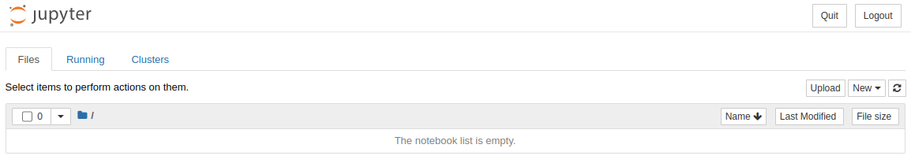

# Getting Started with NearSpace Labs API and Anaconda

The [`nsl.stac`](https://pypi.org/project/nsl.stac/) Python package lets you find aerial imagery by area of interest, data, and other attributes. It also downloads Near Space Labs Geotiffs and thumbnails. The client connects to Near Space Labs [STAC](https://stacspec.org/) service for imagery metadata queries and imagery server to retrieve imagery.

## What you need for this tutorial

Request access to the NearSpace Labs [API](https://nearspacelabs.com/#nearspacelabs). You need these credentials to access services.

For this tutorial, install [Anaconda](https://www.anaconda.com/products/individual) which is a Python distribution that includes [JupyterLabs](https://jupyter.org/install). JupyterLabs provides a web-based interactive environment for data science and machine learning.

We will also use [`nsl.stac`](https://pypi.org/project/nsl.stac/) to connect to NearSpace Labs STAC server and retrieve imagery.

### Best practice

For each Python project, it's best practice to create a virtual environment that contains the packages required by the project. Anaconda includes a package manager called  [`conda`](https://docs.conda.io/en/latest/). Run the following to create a new virtual `conda` environment and activate it.

```bash
$ conda create --name venv python=3.8
$ conda activate venv
```

### Install packages

We need to add the JupyterLabs and numpy to our environment. Note that `nsl.stac` requires `numpy` 1.17.3 or greater and we will install it in the conda environment before installing `nsl.stac`.

```bash
$ conda install jupyter
$ conda install numpy=1.17.3
```

### Adding the nsl.stac package

The conda package manager uses the [Anaconda](https://repo.anaconda.com/) or [CondaForge](https://conda-forge.org/) repositories. The `nsl.stac` package is not available in those repositories, but we can still use pip to install it from the [PyPi](https://pypi.org/) repository. 

```bash

$ pip install nsl.stac
```

## Starting Jupyter

We can start a Jupyter server with your NearSpace Labs credentials

```
$ NSL_ID="<my_id>" NSL_SECRET="my_secret" jupyter notebook
```


