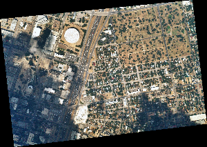

# Downloading

To download an asset use the `bucket` + `object_path` or the `href` fields from the asset, and download the data using the library of your choice. 

```test
   assets {
      key: "GEOTIFF_RGB"
      value {
        href: "https://api.nearspacelabs.net/download/20190822T162258Z_TRAVIS_COUNTY/Published/REGION_0/20190822T183518Z_746_POM1_ST2_P.tif"
        type: "image/vnd.stac.geotiff"
        eo_bands: RGB
        asset_type: GEOTIFF
        cloud_platform: GCP
        bucket_manager: "Near Space Labs"
        bucket_region: "us-central1"
        bucket: "swiftera-processed-data"
        object_path: "20190822T162258Z_TRAVIS_COUNTY/Published/REGION_0/20190822T183518Z_746_POM1_ST2_P.tif"
      }
    }
```

``` bash
$ wget "https://api.nearspacelabs.net/download/20190822T162258Z_TRAVIS_COUNTY/Published/REGION_0/20190822T183518Z_746_POM1_ST2_P.tif"
```

There is also a download utility in the `nsl.stac.utils` module. Downloading from Google Cloud Storage buckets requires having defined your `GOOGLE_APPLICATION_CREDENTIALS` [environment variable](https://cloud.google.com/docs/authentication/getting-started#setting_the_environment_variable). Downloading from AWS/S3 requires having your configuration file or environment variables defined as you would for [boto3](https://boto3.amazonaws.com/v1/documentation/api/1.9.42/guide/quickstart.html#configuration). 

## Thumbnails
To downlad thumbnail assets follow the example below:

```python
import tempfile
from IPython.display import Image, display

from nsl.stac.client import NSLClient
from nsl.stac import utils, enum, StacRequest, GeometryData, ProjectionData

mlk_blvd_wkt = 'LINESTRING(-97.72842049283962 30.278624772098176,-97.72142529172878 30.2796624743974)'
geometry_data = GeometryData(wkt=mlk_blvd_wkt, 
                             proj=ProjectionData(epsg=4326))
time_filter = utils.pb_timestampfield(value=date(2019, 8, 25), rel_type=enum.FilterRelationship.LTE)
stac_request = StacRequest(intersects=geometry_data,
                           datetime=time_filter,
                           limit=3)

# get a client interface to the gRPC channel
client = NSLClient()

for stac_item in client.search(stac_request):
    # get the thumbnail asset from the assets map
    asset = utils.get_asset(stac_item, asset_type=enum.AssetType.THUMBNAIL)
    # (side-note delete=False in NamedTemporaryFile is only required for windows.)
    with tempfile.NamedTemporaryFile(suffix=".png", delete=False) as file_obj:
        utils.download_asset(asset=asset, file_obj=file_obj)
        display(Image(filename=file_obj.name))
```


    

    

    
## Geotiffs

To download geotiff assets follow the example below:

```python
import os
import tempfile
from datetime import date
from nsl.stac import StacRequest, GeometryData, ProjectionData, enum
from nsl.stac import utils
from nsl.stac.client import NSLClient

client = NSLClient()

ut_stadium_wkt = "POINT(-97.7323317 30.2830764)"
geometry_data = GeometryData(wkt=ut_stadium_wkt, proj=ProjectionData(epsg=4326))

# Query data from before September 1, 2019
time_filter = utils.pb_timestampfield(value=date(2019, 9, 1), rel_type=enum.FilterRelationship.LTE)

stac_request = StacRequest(datetime=time_filter, intersects=geometry_data)

stac_item = client.search_one(stac_request)

# get the Geotiff asset from the assets map
asset = utils.get_asset(stac_item, asset_type=enum.AssetType.GEOTIFF)

with tempfile.TemporaryDirectory() as d:
    file_path = utils.download_asset(asset=asset, save_directory=d)
    print("{0} has {1} bytes".format(os.path.basename(file_path), os.path.getsize(file_path)))
```

```text
    20190826T190001Z_761_POM1_ST2_P.tif has 131373291 bytes
```

## Handling deadlines

The `search` method is a gRPC streaming request. It sends a single request to the server and then opens and maintains a connection to the server, which then pushes results to the client. If you have a long running sub-routine that executes between each iterated result from `search` you may exceed the 15 second timeout. If the stac request results create in a memory problem or the blocking behavior limits your application's performance, use `offset` and `limit` as described in [AdvancedExamples.md](https://github.com/nearspacelabs/stac-client-python/blob/master/AdvancedExamples.md).

Otherwise, an easy way to iterate through results without timing-out on long running sub-routines is to capture the `search` results in a `list`.

For example:

```python
import os
import tempfile
from datetime import date
from nsl.stac import StacRequest, GeometryData, ProjectionData, enum
from nsl.stac.utils import download_asset, get_asset, pb_timestampfield
from nsl.stac.client import NSLClient


ut_stadium_wkt = "POINT(-97.7323317 30.2830764)"
geometry_data = GeometryData(wkt=ut_stadium_wkt, proj=ProjectionData(epsg=4326))

# Query data from before September 1, 2019
time_filter = pb_timestampfield(value=date(2019, 9, 1), rel_type=enum.FilterRelationship.LTE)

# limit is set to 2 here, but it would work if you set it to 100 or 1000
stac_request = StacRequest(datetime=time_filter, intersects=geometry_data, limit=2)

# get a client interface to the gRPC channel. This client singleton is threadsafe
client = NSLClient()

# collect all stac items in a list
stac_items = list(client.search(stac_request))

with tempfile.TemporaryDirectory() as d:
    for stac_item in stac_items:
        print("STAC item id: {}".format(stac_item.id))
        asset = get_asset(stac_item, asset_type=enum.AssetType.GEOTIFF)
        filename = download_asset(asset=asset, save_directory=d)
        print("saved {}".format(os.path.basename(filename)))
```

```text
    STAC item id: 20190826T190001Z_761_POM1_ST2_P
    saved 20190826T190001Z_761_POM1_ST2_P.tif
    STAC item id: 20190826T185933Z_747_POM1_ST2_P
    saved 20190826T185933Z_747_POM1_ST2_P.tif
```
